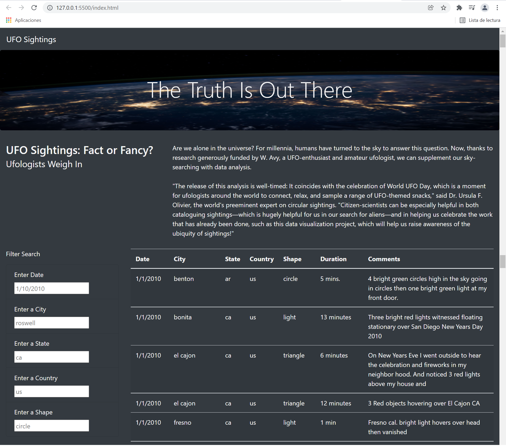
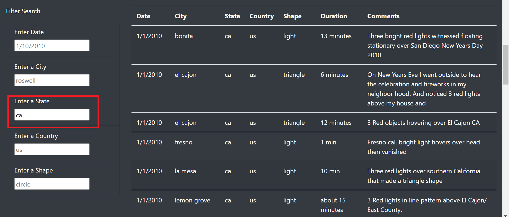
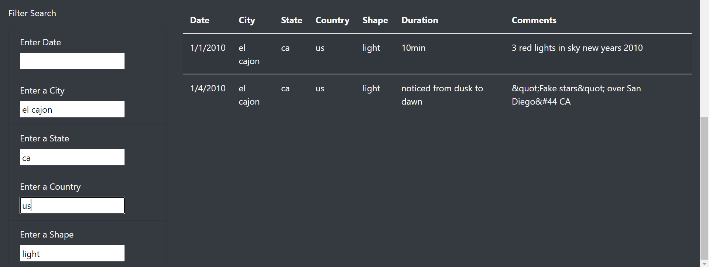

# UFOs

## Overview
UFO Sightings with JavaScript is a project where Dana is a data journalist, and she had the opportunity to write about her hometown, McMinnville, Oregon. Because McMinnville is famous for its UFOs sightings phenomenon, Dana decided to write about this topic with the technical support of JavaScript’s visual functionality. Dana planned to use JavaScript to display UFOs sightings on a Web page table that supports her article and includes filters to fine-tune the results. JavaScript language provides tools to manipulate the data by adding filters.

## Resources
  - Language: JavaScript ECMAScript
  - Development tool: VS Code and Google DevTools 
  - Web Design tools: HTML5, Bootstrap 3 and CSS
  - Data source: data.js

## Results
Using JavaScript and HTML, the table on the UFO sightings Web page has five filters developed with JavaScript tools to manipulate the data. The filters to fine-tune the results are by date, city, state, country, and shape, as the following image showcases.

The Web page has a JavaScript function to loop through the dataset and keep only the results that match the search criteria. The Web page will be updated with the search criteria after pressing "Enter".

The user could include only one filter as match criteria and execute the search to get the filtered results. For instance, typing in "ca" in the State filter.

The user could include together more than two filters as match criteria and execute a search, as the following image showcases.

## Summary
